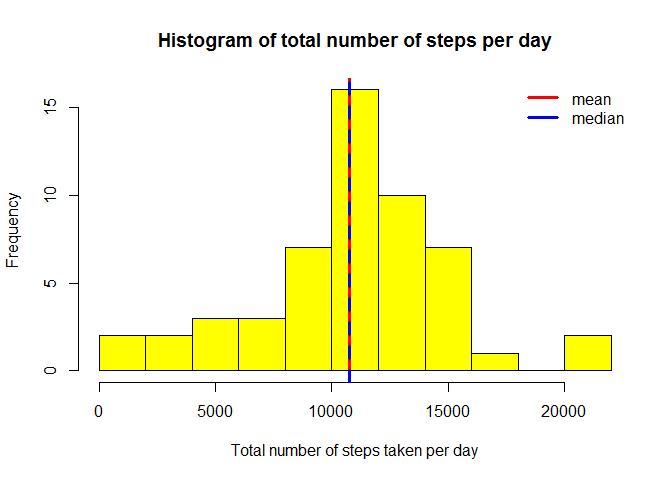
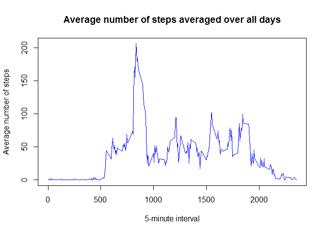
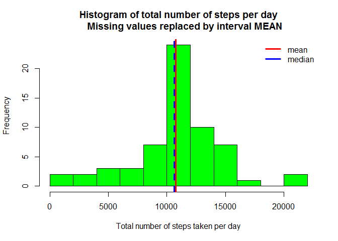
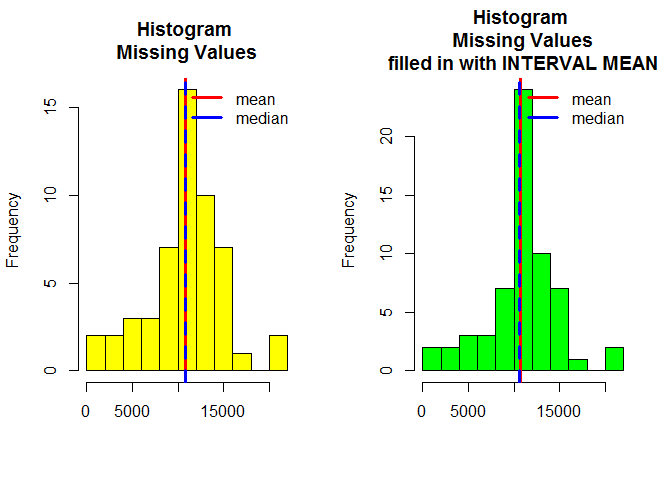
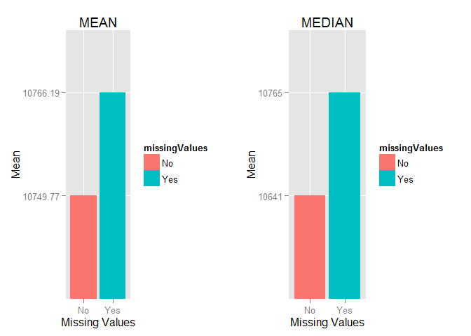
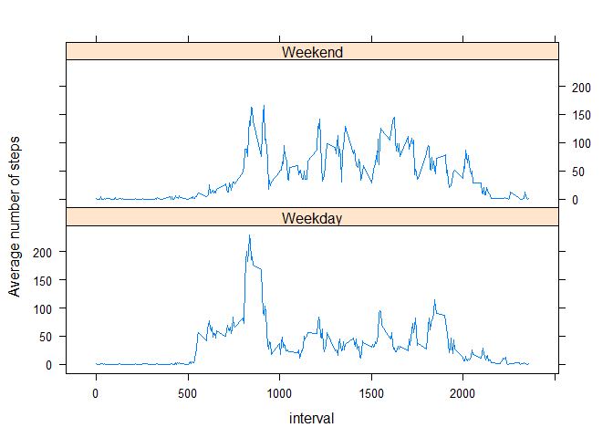

# Reproducible Research: Peer Assessment 1
Lucas Rodrigues Amaral  

## Introduction
It is now possible to collect a large amount of data about personal movement using activity monitoring devices such as a Fitbit, Nike Fuelband, or Jawbone Up. These type of devices are part of the "quantified self" movement - a group of enthusiasts who take measurements about themselves regularly to improve their health, to find patterns in their behavior, or because they are tech geeks.  

But these data remain under-utilized both because the raw data are hard to obtain and there is a lack of statistical methods and software for processing and interpreting the data.  

This assignment makes use of data from a personal activity monitoring device.This device collects data at 5 minute intervals through out the day. The data consists of two months of data from an anonymous individual collected during
the months of October and November, 2012 and include the number of steps taken in 5 minute intervals each day.  

## Data
The data for this assignment can be downloaded from the course web site:

. Dataset: Activity monitoring data [52K]  

The variables included in this dataset are:  
. steps: Number of steps taking in a 5-minute interval (missing values are coded as NA)  
. date: The date on which the measurement was taken in YYYY-MM-DD format  
. interval: Identifier for the 5-minute interval in which measurement was taken  

The dataset is stored in a comma-separated-value (CSV) file and there are a total of 17,568 observations in this dataset.  

## Assignment
This assignment will be described in multiple parts. You will need to write a report that answers the questions detailed below. Ultimately, you will need to complete the entire assignment in a single R markdown document that can
be processed by knitr and be transformed into an HTML file.  

Throughout your report make sure you always include the code that you used to generate the output you present. When writing code chunks in the R markdown document, always use echo = TRUE so that someone else will be able to read
the code. This assignment will be evaluated via peer assessment so it is essential that your peer evaluators be able to review the code for your analysis.  

For the plotting aspects of this assignment, feel free to use any plotting system in R (i.e., base, lattice, ggplot2)

Fork/clone the GitHub repository created for this assignment. You will submit this assignment by pushing your completed files into your forked repository on GitHub. The assignment submission will consist of the URL to your GitHub repository and the SHA-1 commit ID for your repository state.  

NOTE: The GitHub repository also contains the dataset for the assignment so you do not have to download the data separately.

## Libraries:

```r
library(sqldf)
```

```
## Loading required package: gsubfn
## Loading required package: proto
## Loading required package: RSQLite
## Loading required package: DBI
```

```r
library(tcltk)
library(ggplot2)
library(lattice)
library(gridExtra)
```

```
## Loading required package: grid
```

## Loading and preprocessing the data

1. Load the data (i.e. read.csv())

```r
#  Set aspects of the locale for the R process
Sys.setlocale("LC_TIME","English") 
```

```
## [1] "English_United States.1252"
```

```r
# Set the working directory
setwd("C:\\R\\courseraworkspace\\repdata\\RepData_PeerAssessment1")

# Define some options for knitr
knitr::opts_chunk$set(tidy=FALSE, fig.path='figures/')

# Set zip data file name
zipFileName <- "activity.zip"

# Unzip data file name
unzip(zipfile = zipFileName, files = NULL, list = FALSE, overwrite = TRUE, 
     junkpaths = FALSE, exdir = ".", unzip = "internal", setTimes = FALSE)

# Set data file name
dataFileName    <- "activity.csv"

# Read data file name
dsActivity      <- read.csv(dataFileName, na.strings = "NA", colClasses=c("integer", "Date", "integer") )

str(dsActivity)
```

```
## 'data.frame':	17568 obs. of  3 variables:
##  $ steps   : int  NA NA NA NA NA NA NA NA NA NA ...
##  $ date    : Date, format: "2012-10-01" "2012-10-01" ...
##  $ interval: int  0 5 10 15 20 25 30 35 40 45 ...
```

```r
head(dsActivity, 10)
```

```
##    steps       date interval
## 1     NA 2012-10-01        0
## 2     NA 2012-10-01        5
## 3     NA 2012-10-01       10
## 4     NA 2012-10-01       15
## 5     NA 2012-10-01       20
## 6     NA 2012-10-01       25
## 7     NA 2012-10-01       30
## 8     NA 2012-10-01       35
## 9     NA 2012-10-01       40
## 10    NA 2012-10-01       45
```

```r
summary(dsActivity)
```

```
##      steps             date               interval     
##  Min.   :  0.00   Min.   :2012-10-01   Min.   :   0.0  
##  1st Qu.:  0.00   1st Qu.:2012-10-16   1st Qu.: 588.8  
##  Median :  0.00   Median :2012-10-31   Median :1177.5  
##  Mean   : 37.38   Mean   :2012-10-31   Mean   :1177.5  
##  3rd Qu.: 12.00   3rd Qu.:2012-11-15   3rd Qu.:1766.2  
##  Max.   :806.00   Max.   :2012-11-30   Max.   :2355.0  
##  NA's   :2304
```

2. Process/transform the data (if necessary) into a format suitable for your analysis. 


## What is mean total number of steps taken per day?
For this part of the assignment, you can ignore the missing values in the dataset.

1. Make a histogram of the total number of steps taken each day:

```r
# SQL statement that selects the sum and average of steps grouped by date:
st <- " select          date
                        , sum(steps) as stepsSum 
                        , avg(steps) as stepsAvg
        from            dsActivity 
        group by        date"

dsActivityDay <- sqldf(st, drv="SQLite")

dsActivityDay$stepsSum <- as.integer(dsActivityDay$stepsSum)
dsActivityDay$stepsAvg <- as.numeric(dsActivityDay$stepsAvg)

head(dsActivityDay)
```

```
##         date stepsSum stepsAvg
## 1 2012-10-01       NA       NA
## 2 2012-10-02      126  0.43750
## 3 2012-10-03    11352 39.41667
## 4 2012-10-04    12116 42.06944
## 5 2012-10-05    13294 46.15972
## 6 2012-10-06    15420 53.54167
```

```r
# Mean of total number of steps taken per day
stepMean <- mean(dsActivityDay$stepsSum, na.rm=TRUE)

# Median of total number of steps taken per day
stepMedian <- median(dsActivityDay$stepsSum, na.rm=TRUE)


# Plot the histogram
par(mfrow = c(1, 1))
hist(dsActivityDay$stepsSum, col="yellow", 
     breaks = 10,
     main="Histogram of total number of steps per day", 
     xlab="Total number of steps taken per day")

abline(v=stepMean, col="red", lwd=3)
abline(v=stepMedian, col="blue", lwd=3, lty=2)
legend(x="topright", legend=c("mean","median"), col=c("red","blue"), bty="n", lwd=3)
```

 


2. Calculate and report the mean and median total number of steps taken per day.

```r
# Mean of total number of steps taken per day
mean(dsActivityDay$stepsSum, na.rm=TRUE)
```

```
## [1] 10766.19
```

```r
# Median of total number of steps taken per day
median(dsActivityDay$stepsSum, na.rm=TRUE)
```

```
## [1] 10765
```


## What is the average daily activity pattern?
1. Make a time series plot (i.e. type = "l") of the 5-minute interval (x-axis) and the average number of steps taken, averaged across all days (y-axis):

```r
# SQL statement that selects the sum and average of steps grouped by interval:
st <- " select          interval
                        , sum(steps) as stepsSum 
                        , avg(steps) as stepsAvg
        from            dsActivity 
        group by        interval"

dsActivityInterval <- sqldf(st, drv="SQLite")

head(dsActivityInterval)
```

```
##   interval stepsSum  stepsAvg
## 1        0       91 1.7169811
## 2        5       18 0.3396226
## 3       10        7 0.1320755
## 4       15        8 0.1509434
## 5       20        4 0.0754717
## 6       25      111 2.0943396
```

```r
# Plot the time series
par(mfrow = c(1, 1))
plot(dsActivityInterval$interval, dsActivityInterval$stepsAvg, type='l', col="blue", 
     main="Average number of steps averaged over all days", 
     xlab="5-minute interval", 
     ylab="Average number of steps")
```

 


2. Which 5-minute interval, on average across all the days in the dataset, contains the maximum number of steps?

```r
# SQL statement that selects the sum and average of steps grouped by interval ordered by stepsSum descending
st <- "select           * 
        from            dsActivityInterval 
        order by stepsSum desc"

# Select the first line: maximum number of steps
dsMax <- sqldf(st, drv="SQLite")[1,]

# Interval that contains the maximum number of steps
dsMax
```

```
##   interval stepsSum stepsAvg
## 1      835    10927 206.1698
```

## Imputing missing values
Note that there are a number of days/intervals where there are missing values (coded as NA). The presence of missing days may introduce bias into some calculations or summaries of the data.

1. Calculate and report the total number of missing values in the dataset (i.e. the total number of rows with NAs):

```r
# SQL statement that selects the total number of missing values in the dataset:
st <- "select           count(1) as countNA 
        from            dsActivity 
        where           steps           is null 
                or      date            is null 
                or      interval        is null"

dsNA <- sqldf(st, drv="SQLite")

# Total number of missing values:
dsNA
```

```
##   countNA
## 1    2304
```

2. Devise a strategy for filling in all of the missing values in the dataset. The strategy does not need to be sophisticated. For example, you could use the mean/median for that day, or the mean for that 5-minute interval, etc.

<span style="color:blue">
The missing values are replacled by interval MEAN.
</span> 

3. Create a new dataset that is equal to the original dataset but with the missing data filled in:

```r
st <-
"select  a.date
        , a.interval
        , case
                when (a.steps is null) then round(ai.stepsAvg,2)
                else a.steps
        end as steps
from    dsActivityInterval      ai
        , dsActivity            a
where   ai.interval = a.interval"

dsActivityNA <- sqldf(st, drv="SQLite")

head(dsActivityNA)
```

```
##         date interval steps
## 1 2012-10-01        0     1
## 2 2012-10-08        0     1
## 3 2012-11-01        0     1
## 4 2012-11-04        0     1
## 5 2012-11-09        0     1
## 6 2012-11-10        0     1
```

```r
# Verifies if exists any missing value
sqldf("select count(1) as countNA from dsActivityNA where steps is null", drv="SQLite")
```

```
##   countNA
## 1       0
```

4. Make a histogram of the total number of steps taken each day and Calculate and report the mean and median total number of steps taken per day. Do these values differ from the estimates from the first part of the assignment? What is the impact of imputing missing data on the estimates of the total daily number of steps?

```r
# SQL statement that selects the sum and average of steps grouped by date:
st <- " select          date
                        , sum(steps) as stepsSum 
                        , avg(steps) as stepsAvg
        from            dsActivityNA 
        group by        date"

dsActivityNADay <- sqldf(st, drv="SQLite")

head(dsActivityNADay)
```

```
##         date stepsSum stepsAvg
## 1 2012-10-01    10641 36.94792
## 2 2012-10-02      126  0.43750
## 3 2012-10-03    11352 39.41667
## 4 2012-10-04    12116 42.06944
## 5 2012-10-05    13294 46.15972
## 6 2012-10-06    15420 53.54167
```

```r
# Mean of total number of steps taken per day (missing values replaced by interval MEAN)
stepMean2 <- mean(dsActivityNADay$stepsSum, na.rm=TRUE)

# Median of total number of steps taken per day (missing values replaced by interval MEAN)
stepMedian2 <- median(dsActivityNADay$stepsSum, na.rm=TRUE)


# Make a histogram of the total number of steps taken each day
# Missing values replaced by interval MEAN
par(mfrow = c(1, 1))
hist(dsActivityNADay$stepsSum, col="green", 
     breaks = 10,
     main="Histogram of total number of steps per day
     Missing values replaced by interval MEAN", 
     xlab="Total number of steps taken per day")
abline(v=stepMean2, col="red", lwd=3)
abline(v=stepMedian2, col="blue", lwd=3, lty=2)
legend(x="topright", legend=c("mean","median"), col=c("red","blue"), bty="n", lwd=3)
```

 

```r
# Mean of total number of steps taken per day (missing values replaced by interval MEAN)
stepMean2
```

```
## [1] 10749.77
```

```r
# Median of total number of steps taken per day (missing values replaced by interval MEAN)
stepMedian2
```

```
## [1] 10641
```

Do these values differ from the estimates from the first part of the assignment?  
<span style="color:blue">
The values did not differ significantly from the estimates from the first part of the assignment.
</span> 


```r
par(mfrow = c(1, 2))
# Plot the histogram (data with missing values)
hist(dsActivityDay$stepsSum, col="yellow", 
     breaks = 10,
     main="Histogram \nMissing Values", 
     xlab="")
abline(v=stepMean, col="red", lwd=3)
abline(v=stepMedian, col="blue", lwd=3, lty=2)
legend(x="topright", legend=c("mean","median"), col=c("red","blue"), bty="n", lwd=3)


# Make a histogram of the total number of steps taken each day
# Missing values replaced by interval MEAN
hist(dsActivityNADay$stepsSum, col="green", 
     breaks = 10,
     main="Histogram \nMissing Values\nfilled in with INTERVAL MEAN", 
     xlab="")
abline(v=stepMean2, col="red", lwd=3)
abline(v=stepMedian2, col="blue", lwd=3, lty=2)
legend(x="topright", legend=c("mean","median"), col=c("red","blue"), bty="n", lwd=3)
```

 


What is the impact of imputing missing data on the estimates of the total daily number of steps?  

<span style="color:blue">
Filling in missing data with interval MEAN let the metrics almost the same. The graphs below show the mean and median calculated with missing values and missing values filled in with INTERVAL MEAN.
</span> 


```r
# Create a data frame to store the mean and median calculated with missing data and filled data
dsMeanMedian <- as.data.frame(rbind(
        c("Yes"
            ,round(mean(dsActivityDay$stepsSum, na.rm=TRUE),2)
            ,median(dsActivityDay$stepsSum, na.rm=TRUE))
        
        , 
        
        c("No"
            ,round(mean(dsActivityNADay$stepsSum, na.rm=TRUE),2)
            ,median(dsActivityNADay$stepsSum, na.rm=TRUE))), stringsAsFactors=FALSE)

names(dsMeanMedian)             <- c("missingValues", "meanDay", "medianDay")
dsMeanMedian$missingValues      <- as.factor(dsMeanMedian$missingValues)
dsMeanMedian$meanDay            <- as.numeric(dsMeanMedian$meanDay)
dsMeanMedian$medianDay          <- as.numeric(dsMeanMedian$medianDay)

# Show the mean and median with missing and filled data
dsMeanMedian
```

```
##   missingValues  meanDay medianDay
## 1           Yes 10766.19     10765
## 2            No 10749.77     10641
```

```r
# Plot the mean and median with missing and filled data
plot1 <- qplot(x= missingValues
      , y       = meanDay
      , data    = dsMeanMedian
      , geom    = "bar", 
      , stat    = "identity"
      , position= "dodge"
      , main    = "MEAN"
      , xlab    = "Missing Values"
      , ylab    = "Mean"
      , fill    = missingValues)

plot2 <- qplot(x= missingValues
      , y       = medianDay
      , data    = dsMeanMedian
      , geom    = "bar", 
      , stat    = "identity"
      , position= "dodge"
      , main    = "MEDIAN"
      , xlab    = "Missing Values"
      , ylab    = "Mean"
      , fill    = missingValues)

grid.arrange(plot1, plot2, ncol=2)
```

 


## Are there differences in activity patterns between weekdays and weekends?
For this part the weekdays() function may be of some help here. Use the dataset with the filled-in missing values for this part.

1. Create a new factor variable in the dataset with two levels - "weekday" and "weekend" indicating whether a given date is a weekday or weekend day.

```r
dsActivityNA$weekday                 <- c("weekday")

dsActivityNA$weekday                 <- as.character(weekdays(as.Date(dsActivityNA$date)))

weekendList                          <- dsActivityNA$weekday %in% c("Sunday", "Saturday")

dsActivityNA$weekday[weekendList]    <- "Weekend"

dsActivityNA$weekday[!weekendList]   <- "Weekday"

dsActivityNA$weekday                 <- as.factor(dsActivityNA$weekday)
```

2. Make a panel plot containing a time series plot (i.e. type = "l") of the 5-minute interval (x-axis) and the average number of steps taken, averaged across all weekday days or weekend days (y-axis). The plot should look something like the following, which was creating using simulated data.


```r
# SQL statement that selects the sum and average of steps grouped by interval 
# Missing values were replaced by INTERVAL MEAN
st <- " select          weekday
                        , interval
                        , sum(steps) as stepsSum 
                        , avg(steps) as stepsAvg
        from            dsActivityNA
        group by        weekday
                        ,interval"

dsActivityNAInterval <- sqldf(st, drv="SQLite")

head(dsActivityNAInterval)
```

```
##   weekday interval stepsSum   stepsAvg
## 1 Weekday        0       97 2.15555556
## 2 Weekday        5       18 0.40000000
## 3 Weekday       10        7 0.15555556
## 4 Weekday       15        8 0.17777778
## 5 Weekday       20        4 0.08888889
## 6 Weekday       25       71 1.57777778
```

```r
par(mfrow = c(1, 1))

xyplot(stepsAvg ~ interval | weekday
        , data = dsActivityNAInterval
        , layout = c(1, 2)
        , type = "l", 
        , ylab = "Average number of steps")
```

 


